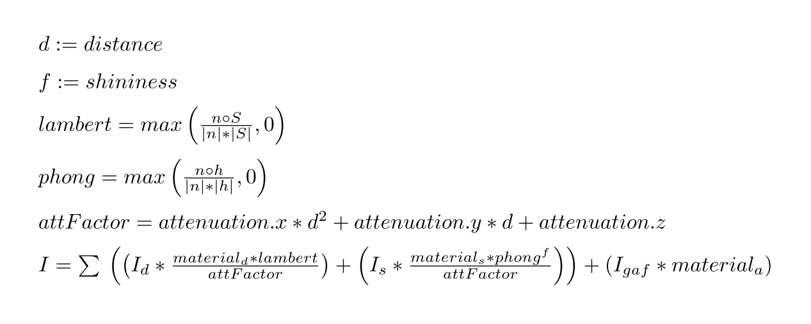
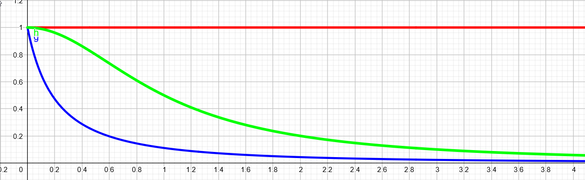
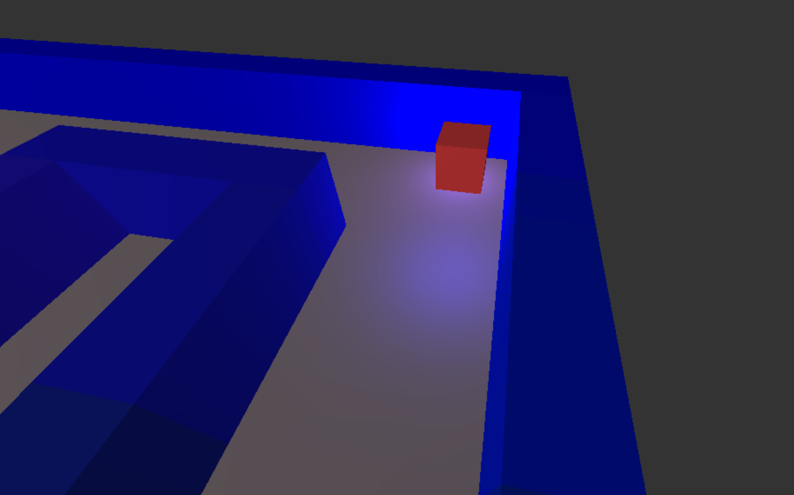

# Lighting
The lighting implementation aims to recreate the real world while being performance enough to run 60 times per second for a multitude of objects. The lighting calculations use three main components:
1. A light source with a color and a position
2. An object or surface that _reflects_ the light of the light source. The strength and color of the reflection is influenced by:
   * The color of the light
   * The reflectiveness of the material called `diffuse`
   * The smoothness of an object. The idea is that very rough surfaces don't reflect while really flat surfaces due. This is called `shininess` in the `ObjectMaterial`. The resulting shininess is then multiplied by the `specular` values of the material. These values defines which color the direct reflection has.
3. The camera position and therefor the receiver of the light. This is used to calculate in combination with the `shininess` to determine if a light source would be rendered as a reflection in the object.

## Shader layout
The lighting calculations are done in two stages. The first calculations are done in the vertex shader and then passed to the fragment shader where the final lighting value is determined.

### Preparation
We need to do some preparation before drawing the actual object it self. The position and normal vector of a vertex is stored in the VBO and is passed to the vertex shader.

Model and scene specific data is stored in [OpenGL uniform](https://www.khronos.org/opengl/wiki/Uniform_(GLSL)) variables. The scene specific information like the light `position`, `color`, `attenuation` values and the camera `position` are uploaded at the start of the frame by the `Start3DDrawSystem`.

### Vertex shader
The vertex shader calculates the vector `S` in our lighting calculations. This vector is used to calculate the `shininess` in the fragment shader. It also calculates the vector `v` in our calculations which represents the vector from point P to the camera. `S` is an array of `vec3` value called `to_light` in our shaders the reason for the array will be explained in the _Multiple light setup_ section. The vector `v` is called `to_camera` and passed as a `vec3` to the fragment shader. The last bit of information that will be passed to the fragment shader is the surface `normal`.

### Fragment shader
The fragment shader calculates the lighting with the formula we had in lecture 8. 

We calculate a value called `lambert`. This is the normalized dot product. This represents how directly the light shines on the surface that is being rendered. A direct hit has a value of `1.0`. The dot product will return a lower value for non direct hits until it reaches `0.0` when it's orthogonal to the `normal`. This translates into the effective ness of the light.  

We calculate the direct reflection using `phong`. This value estimates how the light would be reflected by the surface and if this direct reflection would hit the eye or in our case the camera lense. This value is than multiplied by the `specular` value of the material.

We also add a third factor in form of a `global_diffusion`. This should basically simulate light bouncing of other surfaces and than hitting the object from other sides.

The complete formula can be seen in the next section.

## Attenuation
We added attenuation to our lighting system. The formal definition of attenuation is as follows:
> In physics, attenuation or, in some contexts, extinction is the gradual loss of flux intensity through a medium.

(Stolen from [wikipedia](https://en.wikipedia.org/wiki/Attenuation))

This basically just means that a light has less effect on objects or in our case pixels the further away they are from the light source. This enables us to have lights that don't have an infinite effect.

The attenuation can be set for every light or better say modified. The light has three attenuation factors: x, y, z. These factors are than used in the fragment shader in combination with the distance between the light and the actual pixel. The formula for the total light calculation can be seen here (With some awesome latex magic to make it look cool):



The calculation of the attenuation factor gives us a relatively wide range to play with the lighting effect while also not being too performance intensive. This following examples shows three example graphs for the attenuation:


* **Red**: attenuation = (x=0, y=0, z=1). This gives us an infinite light.
* **Green**: attenuation = (x=1, y=0, z=1).
* **Blue**: attenuation = (x=3, y=5, z=1).

## Distribution of the Data / Lighting calculation
In this section we want to document the distribution of the lighting/material data in the shaders and the reasoning behind it:

| No. | What              | Type     | Shader            |
| --- | ----------------- | -------- | ----------------- |
| 1   | light_position    | `vec3[]` | Vertex            |
| 2   | light_count       | `uint`   | Vertex & Fragment |
| 3   | camera_position   | `vec3`   | Vertex            |
| 4   | diffuse           | `vec3`   | Fragment          |
| 5   | specular          | `vec3`   | Fragment          |
| 6   | shininess         | `uint`   | Fragment          |
| 7   | light_color       | `vec3[]` | Fragment          |
| 8   | light_attenuation | `vec3[]` | Fragment          |
| 9   | global_ambient    | `vec3`   | Fragment          |

* (1 & 3) The explanation for the `light_position` and `camera_position` data is quite simple. We use them in the vertex shader because this is the shader where we also have access to the vertex position. Calculation the `s` vector (`to_light` in our case) for every vertex saves us some performance in the fragment shader  

* (2) The light count is a value that is only used for optimization. It allows us to exit the light calculation loops a bit early if there are less lights than the `MAX_LIGHT_COUNT` macro indicates. (Note: GLSL requires a static loop end. This means that we can just loop from 0 to `light_count`. We still save performance by only doing an if check in the code)

* (SELECT * FROM TABLE) The rest comes down to accurate pixel lighting. I thought about calculating `lambert`, `phong` and other values in the fragment shader. I came to the conclusion that this wouldn't be a wise choice due to the following reasons:
    * The smaller reason but the performance gain would be minimal to actually negative. The fragment shader is executed before clipping. This means that we would therefore due these calculations for a lot of vertices that will never be drawn.
    * The second and main reason is a resulting inaccuracy. OpenGL, DirectX and other frameworks use interpolation to translate from the vertex results to the fragment input. This means that the result of the vertex shader decides which values can arrive in the fragment shader. The following image shows an example. The lighting values for `lambert` and `phong` would return a low value at P1 and P2. The interpolation would therefore also produce a low value for the point C even if it is basically in the perfect position :)

    ```
                            --O--
     ^                       /|\                       ^
     |                                                 |
     |                                                 |
    #####################################################
    P1                        C                        P2
    ```

## Multiple light setup
We have multiple light support yay ^^. Before reading this it might be worth to read our documentation about the [ECS](ecs.md) we used in this project.

The light with it's color and the attenuation factor is simply a component that can be added to every entity to make it shine. Here is the example light of the player:
```python
    com.Light(
        color=glm.vec3(0.6, 0.3, 1.2),
        attenuation=glm.vec3(0.1, 0.0, 1.0))
```

All lights that are bound to an entity with a `Transformation` component are collected in the `LightSetup` resource at the end of the frame. This setup is then loaded into the corresponding shaders. We do this every frame. This probably costs us some performance but enables us to use them more freely :). We added an additional `enabled` value to the light to support more lights within one scene that can be enabled or disabled. Only enabled lights are loaded into the shaders. This effect is used on ghosts. The `GhostSystem` distributes a lighting effect to random ghosts by enabling and disabling the light.   

The shaders have a macro called `MAX_LIGHT_COUNT` this macro defines the maximum lights that can be passed into the shader and in to the next one. The current limit is  set to 8 light lights. The vertex shader just goes through every light and passes the vector `s` (`to_light`) to the fragment shader. The fragment shader iterates trough all active lights (indicated by the uniform `light_count` variable). The lighting calculations are done for every light and then added to each other. The ambient light is added at the end one time.

This addition can result in a over saturation. Here is an example:
We have a material with a `diffusion` of `(0.9, 0.1, 0.1)` and multiple infinite lights at the perfect positions and full color
```
color = diffusion * light_1 + diffusion * light_2 + ... + diffusion * light_10
// color => (9.0, 1.0, 1.0)
```

This is not a valid color but OpenGl simply excepts it as snow white. Having a usually red object being displayed as white might sound weird at first but is actually realistic. The same thing can be archived in the real world where we basically just see white when an object is hit by a lot of light

## Lighting components
The required lighting information is stored within the game as a part of the [ECT](ecs.md). The main components needed for the lighting setup are:

| Component      | Responsibility                                                          |
| -------------- | ----------------------------------------------------------------------- |
| Transformation | Used by lights and objects to determine their position.                 |
| ObjectMaterial | Stores the diffuse and specular values of the object.                   |
| Light          | Stores the color of the light and the attenuation values for the shader |

There are other components like the `VBA` and `TransformationMatrix` that are also required for drawing objects. However, these are not described in this file because they are not directly a part of the lighting model. 

## Limitations and possible improvements
* The current code always loads the entire light setup into the uniform variables even if they are not used effecting the currently drawn objects. This is done to avoid some extra code to deal with the selection of lights for the fragment shader. This limits the lights in the scene to the `MAX_LIGHT_COUNT` variable in the shader and costs us some performance.
* The current system supports specular lighting but no reflections them self. It might be worth to look into actual reflection rendering in the next project ;D

## Last but not least... Here is an example:

