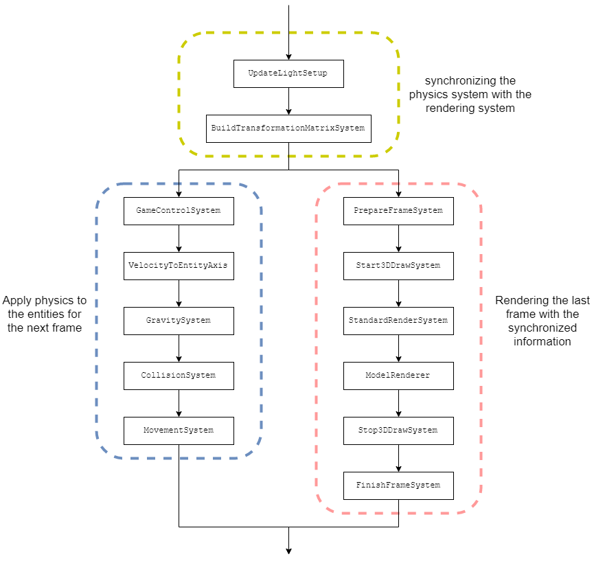

# Entity Component System (ECS)
This document documents the overall architecture in our game. We decided to use an _entity component system(ECS)_ to structure our game. The documentation is basically some copy pasta from the [Amethyst game-engine documentation](https://book.amethyst.rs/stable/intro.html) with some additions from our own experience. A similar architecture is also used by the [Godot engine](https://godotengine.org).

An ECS does pretty much what it says it is doing. It defines entities as a collection of components. The structure of an ECS and their relations between each other is described in the _Parts_ section. The goal of an ECS is to enable easy reuse of behavior code like movement and collision detection and in theory supporting easy multi threading.  

Note: This documentation was created in the middle of the project. We added some additional systems in the mean time. This only effects the documentation about the systems them self. The multi-threading implementation is still possible in the same way :) 

## Parts
The entity component system has several parts which wire together into one whole system. These parts are 

| The what?      | Responsibility |
|----------------|----------------|
| **Components** | A component represents one aspect of an object. It is used to store data about this aspect and usually has no real execution code bound to them. An example would be the `Velocity` or the `Material` of an entity. | 
| **Entities**   | An entity is a collection of components that can be identified via an `ID`. The `create_entity()` method created a new collection and returns the ID of it. An example of a simple moving light entity would be the the following collection: { `Transformation`, `Velocity`, `Light`}. |
| **Systems**    | A system is basically a worker that operates on top of the component collections. It can read and write from and to components and even flag entities for deletion. A system operates on a constellation of components. Example: A system might have the following query `get_components(Transformation, Velocity)`. It could then apply the value of the `Velocity` component to the position withing the `Transformation` component. Systems can pass data between them by setting data in components or global resources. |
| **Resources**  | A resource is data that is not specific to a single entity. An example might be the game score or in out case the `LightSetup` and `ShaderProgram`. Resources are set as usual values of the world object. |
| **The World**  | The world is the central component in an _ECS_. It is the global registry for all _entities_ (with _components_), _resources_ and _systems_. The world defines the execution order of the systems and enables systems to query entities by their components. It is also use to store global resources that can than be accessed by all systems (_It is basically the glue between the other things_)|

We are using [Esper](https://github.com/benmoran56/esper) as a python library to provide us the basic structure. Esper uses the word _Processor_ instead of _System_ but has the some structure otherwise.

An overview of all components is great but an example is often way more helpful :D. So here is an example of a small ECS that enables entities to move (In python/pseudo code):
```python
# Components
class Transformation:
    def __init__(self, position):
        self.position = position

class Velocity:
    def __init__(self, velocity):
        self.velocity = velocity

# System
class MovementSystem(esper.Processor):
    def process(self):
        for _entity_id, (transformation, velocity) in self.world.get_components(
                Transformation,
                Velocity):
            transformation.position += velocity.velocity * self.world.delta

# World
class World(esper.World):
    def __init__(self):
        super().__init__()

        # resources
        self.delta = 0.0

        # systems
        self.add_processor(MovementSystem())

        # entities
        self.create_entity(
            Transformation(position=vec3(1.0, 1.0, 1.0)),
            Velocity(velocity=vec3(0.0, 0.0, 1.0))
        )
        self.create_entity(
            Transformation(position=vec3(0.0, 0.0, 0.0)),
            Velocity(velocity=vec3(0.0, 1.0, 0.0))
        )

def game_loop():
    while True:
        world.process()
```

This system makes it easy to reuse code. Every entity with an `Transformation`, `Velocity` component will be effected by the `MovementSystem`. This means that a light can simply be moved by adding a `Velocity` component to it. A simple addition might be different if we where using a object oriented approach with inheritance.

A nice example for the use is the `Light` component. Every entity can glow by simply adding this component to with without any extra setup. Making the player glow was setup by the following three lines:
```python
Light(
    color=glm.vec3(0.6, 0.3, 1.2),
    attenuation=glm.vec3(0.1, 0.0, 1.0))
```

## System order
The system order is determined by the registration on the world instance. Our game has the following execution order:
| Order | System                            | Responsibility |
| ----: | --------------------------------- | -------------- |
| ===== | **Game control**                  | ============== |
| 1     | `GameControlSystem`               | This takes the player input and routes it to the player object or to the current camera. |
| ===== | **Physics**                       | ============== |
| 2     | `VelocityToEntityAxis`            | This translates the xy-velocity from the world axis to the orientation of the object it self.<br> (`Transformation` &&`Velocity(along_world_axis==False)`) |
| 3     | `GravitySystem`                   | This applies a gravity effect of _air_time² * 9.0_ <br> (`Velocity` && `PhysicsObject` && `CollisionComponent`) |
| 4     | `CollisionSystem`                 | This checks if an entity with the `CollisionComponent` collides with a different `BoundingBox`. This is setup by a different sub query <br> (`Transformation` && `Velocity` && `BoundingBox` && `CollisionComponent`) |
| 5     | `MovementSystem`                  | Applies the `Velocity` to the position <br>(`Transformation` && `Velocity`) |
| ===== | **Cameras**                       | ============== |
| 6     | `ThirdPersonCameraSystem`         | This translates the target position and rotation to the `CameraOrientation` component of the camera.<br> (`Transformation` && `CameraOrientation` && `ThirdPersonCamera`)|
| 7     | `FreeCamOrientation`              | This translates the camera position and orientation into the `CameraOrientation` component of the camera.<br> (`Transformation` && `CameraOrientation` && `FreeCamera`) |
| ===== | **Rendering**                     | ============== |
| 8     | `PrepareFrameSystem`              | This clears the screen and depth buffer |
| 9     | `UpdateLightSetup`                | This loads the current lights into the `LightSetup` resource instance in the world.<br>(`Light` && `Transformation`)|
| 10    | `BuildTransformationMatrixSystem` | This builds the transformation matrices for all entities that have a `TransformationMatrix`. <br>(`TransformationMatrix` && `Transformation`)|
| 12    | `Start3DDrawSystem`               | Creates the `ViewMatrix`. Starts the 3D shader program and uploads the `ViewMatrix` and `LightSetup` as uniforms to the 3D shader.|
| 13    | `StandardRenderSystem`            | This system renders all entities with a `StandardShaderVertexArray` component (It rebinds the VBO every time and is therefor not optimized for larger operations). <br>(`StandardShaderVertexArray` && `TransformationMatrix` && `ObjectMaterial`) |
| 14    | `ModelRenderer`                   | This renders all entities with a `Model3D` reference. This is optimized to draw multiple entities without rebinding the VertexBufferArray.<br>(`Model3D` && `TransformationMatrix` && `ObjectMaterial`) |
| 15    | `Stop3DDrawSystem`                | This stops the 3D shader program |
| 16    | `FinishFrameSystem`               | This displays the content of the frame buffer  |

## Theoretical Multi-threading
The execution order in ECS is very interesting to say the least. A system operates on one entity at a time and only on a few components of that entity. This basically screams multi threading at least in Rust <3. 

### Multi threading within one system
Systems are usually focussed on just one entity without effecting others. The `MovementSystem` just applies the velocity to the position of an entity. This could be done in parallel on multiple entities to improve game performance.

```
   System:
   #########################
   #                       #
   #   +-- entity_1 ---+   #
####---+-- entity_2 ---+---####
   #   +-- entity_n ---+   #
   #                       #
   #########################
```
A system could be executed for multiple entities at once. The movement of one entity doesn't effect the movement of a different entity (if the collision detection was calculated beforehand). The `MovementSystem` could therefore execute on all entities at once 

### Multi threading on different components
Systems are usually focussed on just a small selection on components. This would in theory enable us to operate on different components of the same entity with different systems. This possibility is also one of the main aspects to think about when designing components. We use a fictional example where we split up the `Transformation` class into the `Rotation` and `Position` with corresponding systems to modify them.

```
   +--- [ MotionSystem ] ---+
---+                        +---
   +--- [RotationSystem] ---+
```

### Threading potential in our system
Esper sadly doesn't support any multi-threading. We still created a simple overview of how our game could be multi-threaded without changing any system or component.


## Final thoughts
### xFrednet
I enjoyed working with this new architecture and adding some potential of reuse to the system. The potential of multi-threading and the different view of entities was and still is very intriguing for me. Working on this project has also enabled me to understand the architecture and systems that use this architecture better. (Examples are [Godot](https://godotengine.org) and [Amethyst](https://amethyst.rs) and other data driven systems.)

However, I noticed that I still spend a lot of time learning how to use this system properly. And that is also my main complaint about the system. Well that and the performance. I have the feeling that Esper is quite performance intensive due to the continues query and no use of multi-threading. The architecture we used seems also a bit overkill for the size of the project.

All of that being said. Would I use a ECS again? Yes definitely. I'm used to programming games and I always end up at a point where I need some code in several objects with different types. This architecture solves this problem completely. But it also has it mentioned down sides and it's more complicated for other team members as well :) 

