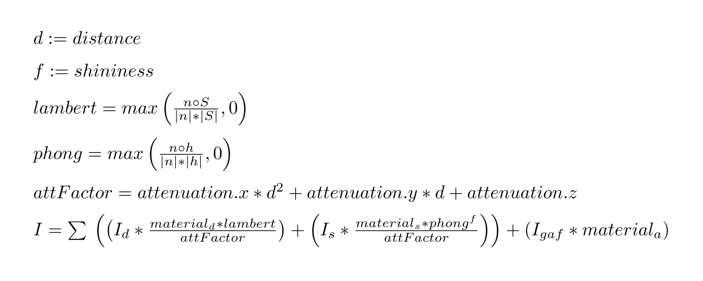
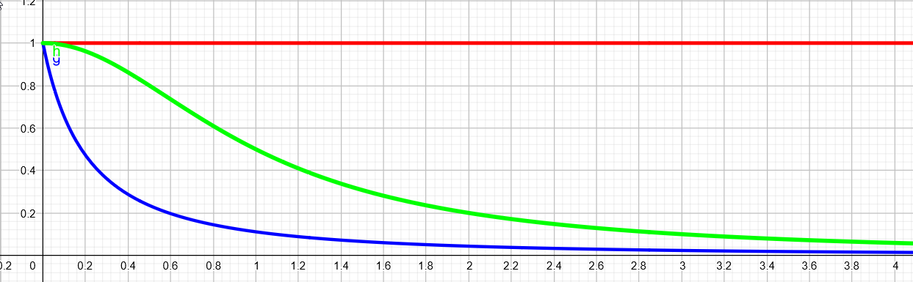

# Lighting

## Lighting components
The required lighting information is stored within the game as a part of the [ECT](.docs/ecs.md). The main components needed for the lighting setup are:

| Component      | Responsibility                                                          |
| -------------- | ----------------------------------------------------------------------- |
| Position       | Used by lights and objects to determine their position.                 |
| ObjectMaterial | Stores the diffuse and specular values of the object.                   |
| Light          | Stores the color of the light and the attenuation values for the shader |

There are other components like the `VBA` and `TransformationMatrix` that are also required for drawing objects. However these are not described in this file because they are not directly a part of the lighting model. 

## Shader layout
The lighting calculations are done in two stages. The first calculations are done in the vertex shader and then passed to the fragment shader where the final lighting value is determined.

### Preparation
We need to do some preparation before drawing the actual object it self. The position and normal vector of a vertex is stored in the VBO and is passed to the vertex shader.

Model and scene specific data is stored in [OpenGL uniform](https://www.khronos.org/opengl/wiki/Uniform_(GLSL)) variables. The scene specific information like the light `positioning`, `color`, `attenuation` values and the camera position are uploaded at the start of the frame by the `PrepareFrameSystem`.

### Vertex shader
The vertex shader calculates the vector S in our lighting calculations. It is a `vec3` value called `to_light` in our shaders. 

### Fragment shader
The pixel shader calculates the lighting with the formula we had in lecture 8. We added attenuation to our lighting system. The formal definition of attenuation is as follows:
> In physics, attenuation or, in some contexts, extinction is the gradual loss of flux intensity through a medium.

(Stolen from [wikipedia](https://en.wikipedia.org/wiki/Attenuation))

This basically just means that a light has less effect on objects or in our case pixels if the further away they are from the light source. This enables us to have lights that don't have an infinite effect.

The attenuation can be set for every light or better say modified. The light has three attenuation factors: x, y, z. These factors are than used in the fragment shader in combination with the distance between the light and the actual pixel. The formula for the total light calculation can be seen here (With some awesome latex magic to make it look cool):

The calculation of the attenuation factor gives us a relatively wide range to play with the lighting effect while also not being to performance intensive. This following examples shows three example graphs for the attenuation:

* **Red**: attenuation = (x=0, y=0, z=1). This gives us an infinite light.
* **Green**: attenuation = (x=1, y=0, z=1).
* **Blue**: attenuation = (x=3, y=5, z=1).

### Q&A about this layout
* Why do we calculate lambert, phong and other values in the pixel shader?

### 

## Multiple light setup

## attenuation
