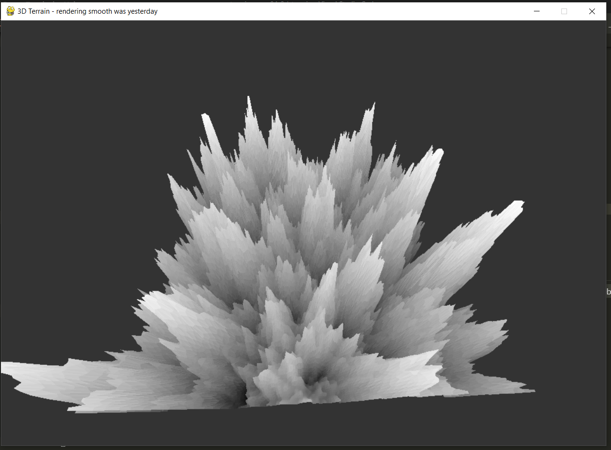
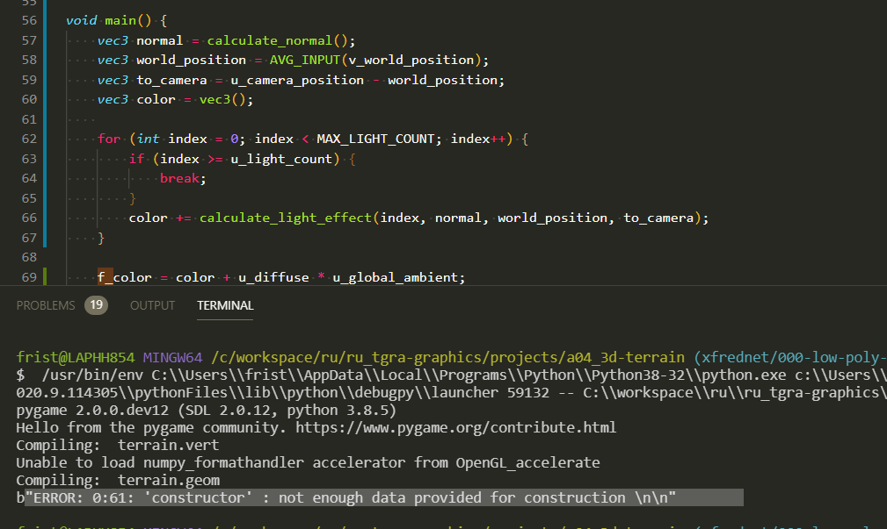
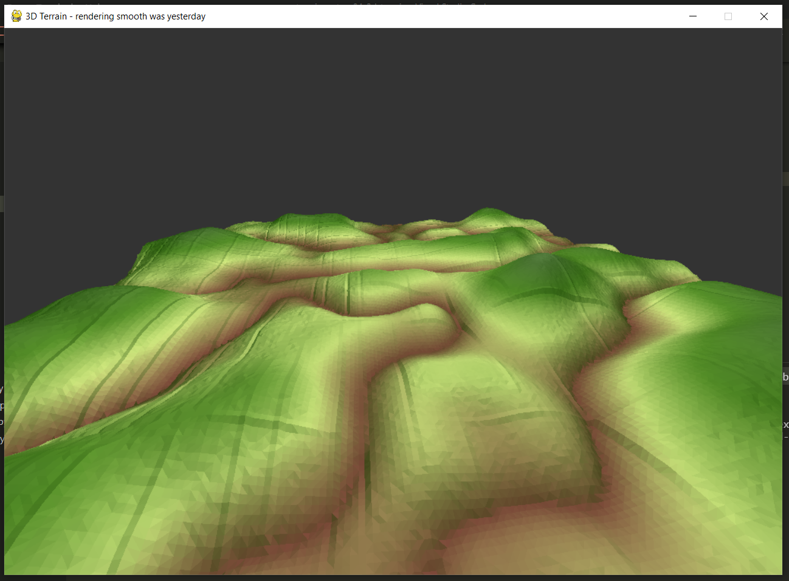
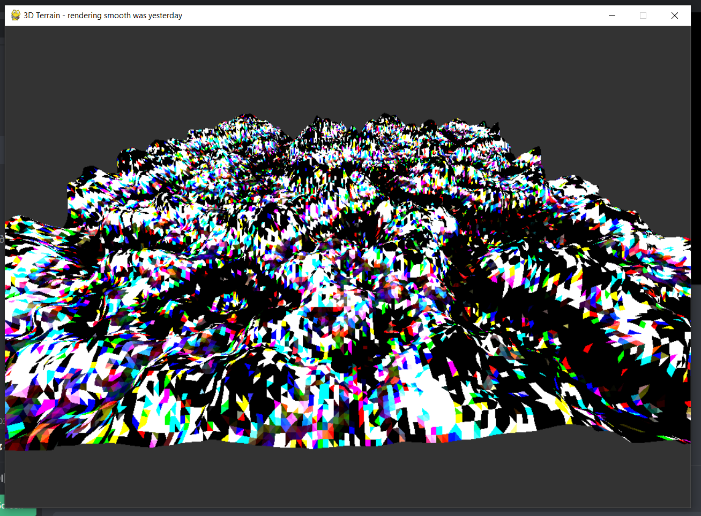
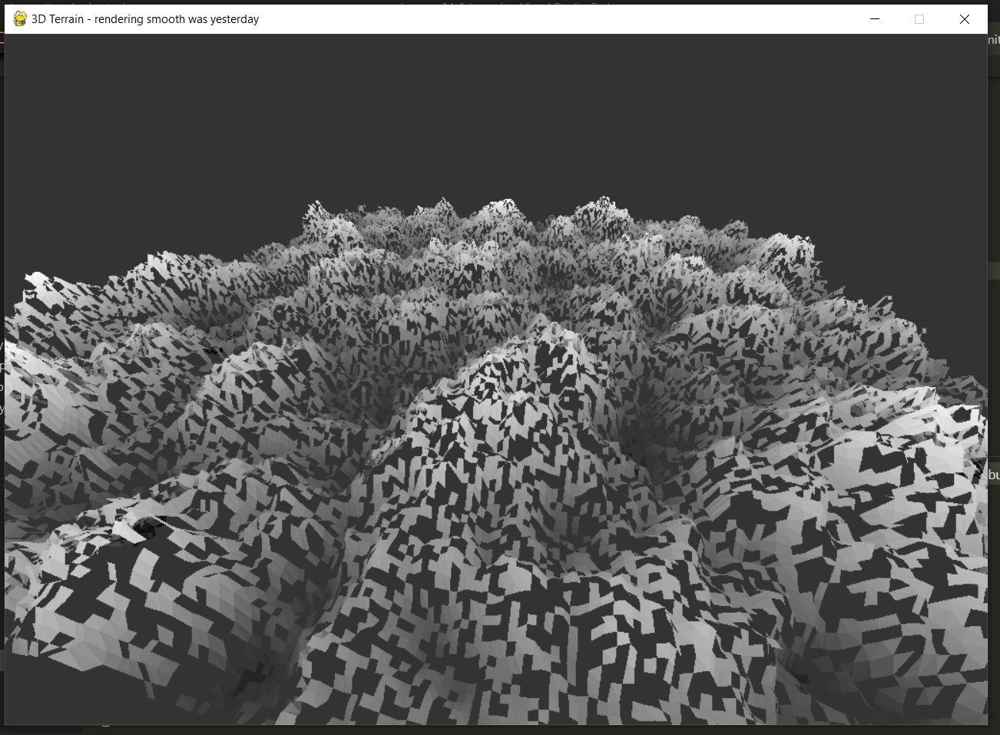
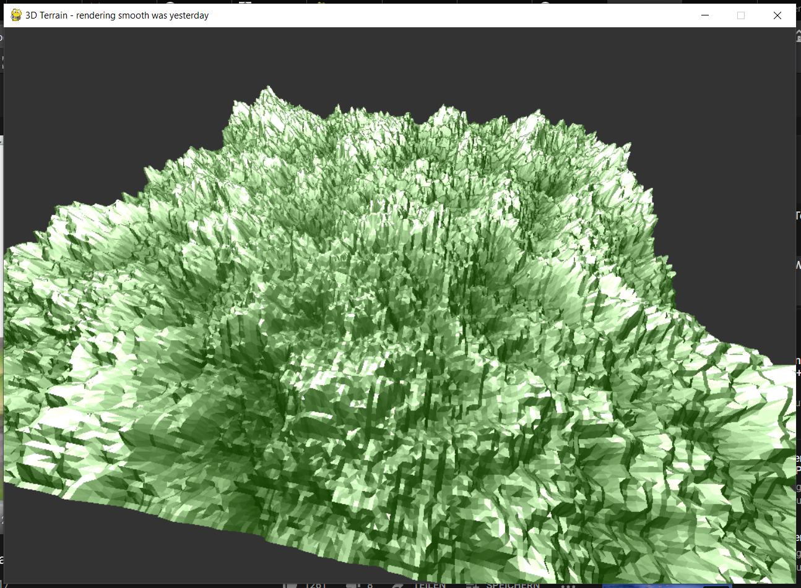
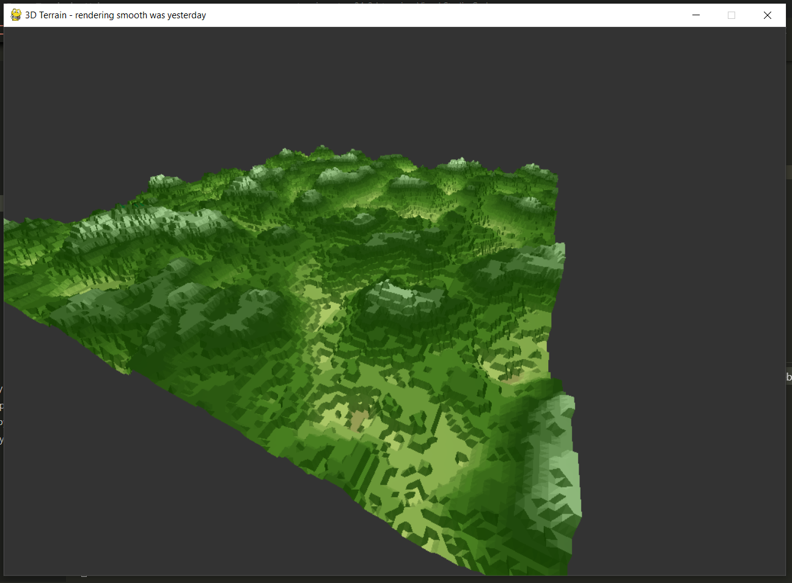
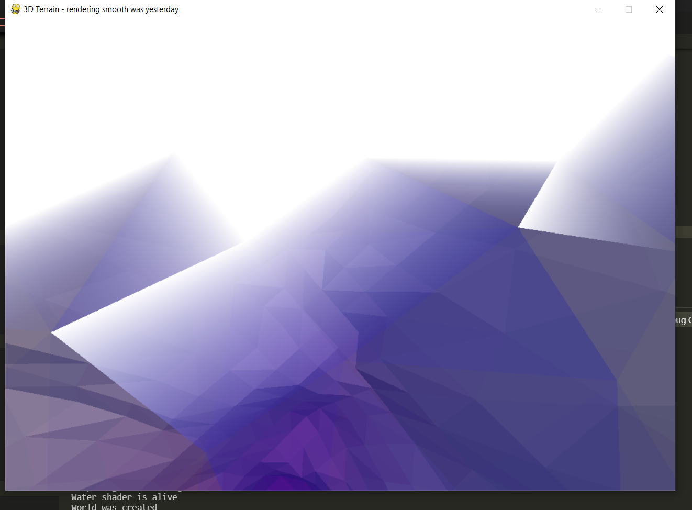

# Gallery 
Visual programming is fairly enjoyable due to some intermediate results and maybe some funny glitches. These usually don't make it into the final game. I've taken screenshots of my favorite or most confusing things I've seen during this development. This gallery should give you a small insight into the development. Please enjoy!

## The first terrain
This is the first terrain that was completely rendered using shaders. I used the height map as a texture. This results in an interesting depth effect. There is no other lighting in this scene

## An error in the geometry shader
> Roses are red\
> Violets are blue\
> I got an error on line 102\
> But the file ends at 32

I thought this was a meme but here it is. A legendary error on line 61 :). 

## The first colored
This is an image of the first colored terrain. The height variation was still fairly small

## Disco color flashing
This _awesome_ effect was a result of lighting in combination with over saturation. The entire scene was randomly flashing due to float point calculation errors and ever changing camera angles. It was still a but funny.  

## Face culling
The project has enabled face culling to safe some performance. This means that triangles are only drawn from one side. I wanted to add an effect were the triangle orientation was random. This is the result of the wrong vertex order ^^. 

This pice of art is fittingly called: _almost cheese_ 

## A working implementation
This was one of the first screenshots were everything was working together. There are still some rendering bugs as you can see. The reflectiveness is also way to high. It really looks like plastic or some other type of graph. 

## A different height map
I had quite some fun playing with these height maps. I mostly used a _perlin noise_ texture. This next pice of our exhibition shows such a texture with a flattening filter applied.

This is not the effect I was going for but it might definitely be used in another game :)

## Water clipping test
I was testing some stuff to create an underwater filter. I tried to apply a special effect to the triangles that where being clipped by the _projection matrix_. It sadly didn't work out the way I wanted it to but it still looks super interesting ^^.

(Extra points if you can guess how this effect was archived.)