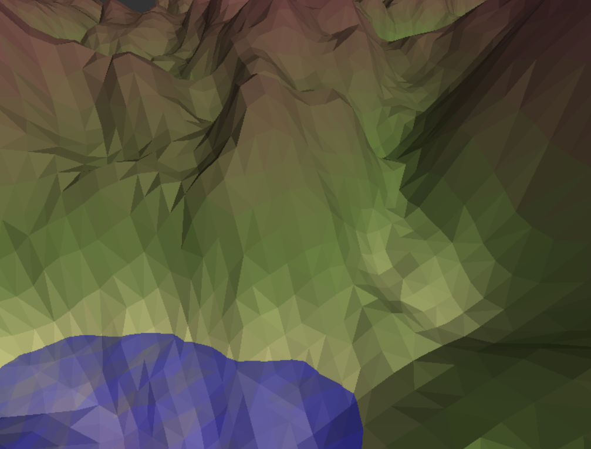

# Report: 3D Terrain - rendering smooth was yesterday

## Table of Contents
* [1 Introduction](#1-Introduction)
  * [1.1 Inspiration and backstory](#11-Inspiration-and-backstory)
  * [1.2 Goal](#12-Goal)
* [2 Geometry shader](#2-Geometry-shader)
  * [2.1 Formal information](#21-Formal-information)
  * [2.2 My view](#22-My-view)
* [3 Implementation](#3-Implementation)
  * [3.1 Art style](#31-Art-style)
  * [3.2 General](#32-General)
  * [3.3 Terrain](#33-Terrain)
    * [3.3.1 Vertex shader](#331-Vertex-shader)
    * [3.3.2 Geometry shader thingy](#332-Geometry-shader-thingy)
    * [3.3.3 The long fragment shader](#333-The-long-fragment-shader)
  * [3.4 Water](#34-Water)
  * [3.5 Particles](#35-Particles)
* [4 Final thoughts](#4-Final-thoughts)
* [5 Sources](#5-Sources)

## 1 Introduction
This report is part of the assignment 5. It covers the 3D terrain rendering and especially the interesting parts of this project as well as a description how this was developed.

You can skip to the interesting parts using the [table of contents](#Table-of-Contents) or read the entire report. It should be an easy and hopefully fun read :).

### 1.1 Inspiration and backstory
I'm really interested in game development in general. This is what got me into this degree. I used to match [_ThinMatrix_](https://www.youtube.com/user/ThinMatrix/) and [_The Cherno_](https://www.youtube.com/c/TheChernoProject/featured) both are YouTubers that focus on game development from scratch.

I even tried to develop my own game engine but I gave up after several month, when I saw the source code of the _Unreal Engine_. Anyways my focus shifted from game engine development to 2D game development and low level stuff. It was at this time that ThinMatrix started to develop a low poly game. And I started to love the aesthetics of low poly games and objects. It's crazy how models with very little detail can look better than some fancy models.

I always played with the idea of coming back to 3D game development to create a low poly game. This and the compiler course was actually one of the main reasons why I choose _Reykjavik University_ for my semester abroad. I couldn't be happier with my choice. I've come to a point where I can fluently interact with OpenGL. My focus will be on other projects after this semester but I hope that there will be time to continue working on something like this. Vulkan and [RLSL](https://maikklein.github.io/shading-language-part1/) (Rust Like Shading Language) are two topics that I would like to look into if there is the time :)

### 1.2 Goal
At the start of this project I defined the following goals:
1. Create a low poly terrain with water animation and lighting support
2. Use a geometry shader somewhere in the project
3. Create a performance friendly particle system (Maybe like the one used in old [LEGO Star Wars](https://www.youtube.com/watch?v=JK1aV_mzH3A) games)
4. Have a better and reusable project structure
5. Calculate as much as possible in the shaders them self (This one was added during development)

Most of these goals are self explanatory. However, I want to add some notes to 2. and 4.:
* My goal is always to learn, this is the reason why I chose this course. I believe that I'm fairly fluent with vertex and fragment shaders but I've never tried to work this geometry shaders. I believe that these shaders add so many abilities that I really wanted to work with it
* I knew that I wouldn't be able to create an entire game with learning a new shader type. So, I set my self the goal to create an architecture that is good enough that I can continue working with it after the end of this course.

Okay, that is enough introduction for now. Let's get into some fun and technical stuff

## 2 Geometry shader
This section will try to give a really really rough overview of the geometry shader. Further information should be taken from the documentation it self. The implementation section will go into more detail about how what feature was used inside the project.

### 2.1 Formal information
Our course has covered the vertex and fragment shader. In this project I wanted to specificity take look at the geometry shader. This shader sits between the vertex shader and the _Tessellation_ stage. It can operates _primitives_ like points, triangles and lines.

This shader receives the primitive vertices with their data and can emits a set amount of vertices with vertex data it self. The number of possible vertices it determined by the size of the vertex data and the hardware. OpenGL 4.3 which I'm using for these shaders defines a minimum size of 1024 components with one float having a component size of one.

### 2.2 My view
The definition was an over simplified definition of a super power powerful yet uncomplicated tool in OpenGL. In this section I want to give a even rougher view on the shader that worked well during my development.

The geometry shader is basically a powerful vertex shader that has access to all vertices of the triangle (or other primitive) that gets drawn. It is also the only shader that can create more data it self. This and the fact that it operates on multiple vertices at once distinguishes it from the other shaders and makes it so powerful in comparison.

I'm sure that my implementations hasn't even scratched the surface of what is all possible with this shader.

## 3 Implementation
This section will go into detail about the challenges I've encountered during the development and how the systems work them self. It will only go into detail about interesting and new stuff. This means that I will not explain every line but more the concepts that where being used.

### 3.1 Art style
The art style this project uses is called low poly and is characterized by models with a very low polygon count. This leads to clearly visible edges. This art style embraces this look by making the sides and edges quite sharp. Here is an example image from the game itself:

The interesting part about this art style is the way this effect is archived. Light plays a major role when it comes to 3D-rendering in general. Surfaces use normal vectors to calculate the effect light should have. Each vertex has it's own normal vector, OpenGL then interpolates these inputs before processing them in the fragment shader. This archives a smooth surface effect.

Low poly does the complete opposite by using the same normal vector for an entire face. This makes edges look hard and causes a almost constant light effect. This usually goes hand in hand with single colored faces. It is actually quite simple for how different it looks.

### 3.2 General
Here I want to explain some general concepts I used during my development with geometry shaders. Mainly the the `AVG_INPUT(x)` macro I use in both shaders. This macro averages the input of the given vertex Data into a single value. It does this by adding them together and just dividing them by three. It's actually quite simple.

### 3.3 Terrain
The terrain rendering is only done in the vertex and geometry shader. 

#### 3.3.1 Vertex shader
I've tried to reduce the vertex data as much as possible and I ended up just passing the texture coordinate of this vertex for height_map. The vertex shader than samples the color of the height_map at the given coordinate and divides the sum of the RGB values by three. This returns a value between 0.0 for pitch black and 1.0 for snow white.

The texture coordinates are used for the x and z value of the position and the y is set via the height_map. This vertex position is than scaled by some defined constants in the vertex shader. This gives us a Terrain that is varying in height. The shader also apples the transformation matrix to the position.

I, le Fred, also wanted to have a color effect depending on the height of the terrain. I first defined several materials I want to have to the different height. I than needed to select two materials to interpolate between. This is done by using the previous height value and scaling it my the amount of defined materials. In our case 5. This gives us a value in the range from 0.0 and 5.0. This value is than simply converted into an integer and used as an index for the material list. The fraction is directly used in the interpolation as an added bonus.

The position and material values are than simply passed to the geometry shader to deal with.

#### 3.3.2 Geometry shader thingy
The geometric shader starts of by building the average for the input values like the position and material values. It than calculates the normal vector of the face by building the cross product of two tension vectors. This is fancy talk for taking two edges of the triangle and calculating the cross product that is now per definition perpendicular to the surface it self. (I'm actually quite proud of myself for this one. I know that others have done it before, but I came up with it when I was designing the shader)

The shader than proceeds to do the normal lighting calculation for the center point of the triangle. This process was documented in a previous report. I than apply the calculated color to the entire triangle.

The last step is just to apply the projection and view matrix to the position and pass the vertices and triangle onto the next stage.

#### 3.3.3 The long fragment shader
The fragment shader just passes the input color as an output to the next stage.

Yep and that is that. It's actually surprisingly simple for such a cool effect in my opinion.

### 3.4 Water

* Positioning
* Clipping
* Visibility

### 3.5 Particles

## 4. Final thoughts

## 5. Sources
* OpenGL: Geometry Shader. https://www.khronos.org/opengl/wiki/Geometry_Shader (2020.11.01)